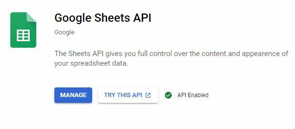
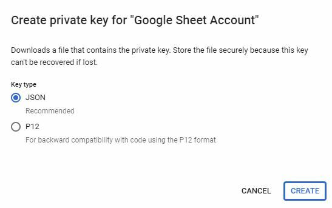

# O que esse projeto faz?
Esse projeto disponibiliza links de gravações do zoom armazenados em uma planilha pré definida. Essa disponibilização fica dentro de um ambiente seguro por uma senha pré definida.


# Posso utilizar esse projeto para meu uso pessoal?
Sim, pode usar! Para isso, seguir os passos abaixo:

## Recursos necessários:
- Ter uma conta no [google console](https://console.cloud.google.com/)
- Uma planilha no [google sheets](https://www.google.com/sheets)
- Ter uma conta na [vercel](https://vercel.com/)

## Configurando tudo

### Github
Primeiro faça um fork desse projeto para seu github.

### Configurando projeto no google console
1 - Abra [google console](https://console.cloud.google.com/)
2 - Crie um projeto ou você pode fazer isso por esse [link](https://console.developers.google.com/projectcreate) 
3 - Volte para a página `APIs & Services` e vá em `ENABLE APIS AND SERVICES` e procure por `Google Sheets API` e habilite-o



4 - Volte novamente para `APIs & Services` e click em `Credentials`, `CREATE CREDENTIALS`
5 -Volte para a página Credenciais, em Contas de serviço, você verá seu e-mail criado para esse serviço
6 - Selecione-o e click em `ADD KEY` e escolha JSON como tipo. Em seguida iniciará o download das chaves, baixe-as.



7 - Agora crie uma planilha no google sheets caso vc já não a tenha, essa planilha precisa ter o seguinte layout:


8 - E compartilhe essa planilha com o email do serviço que criamos nos passos anteriores

## Configurando vercel
1 - Crie um projeto na vercel indicando o link do repositório do seu projeto
2 - Inclua as variáveis de ambiente:
```
MASTER_PASSWORD=<senha para acessar seu projeto>
GOOGLE_SHEETS_CLIENT_EMAIL=<email do serviço que criamos>
GOOGLE_SHEETS_PRIVATE_KEY=<pegue esse valor da credential que fizemos download>
SPREADSHEET_ID=<pegue o ID da planilha>
SPREADSHEET_TAB_NAME=<o nome da aba dentro da planilha>
```

# Por que `one-for-all` ?
Personagem de um anime chamado [`My Hero Academia`](https://pt.wikipedia.org/wiki/Boku_no_Hero_Academia). O personagem `One for all` é um super-herói que possui poderes herdados de forma cumulativa dos heróis antepassados. Os poderes são passados de pessoa a pessoa escolhida a dedo, sendo essa a última se tornando o novo `One for all`.

